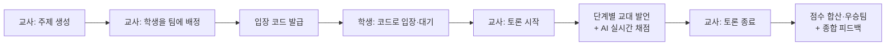
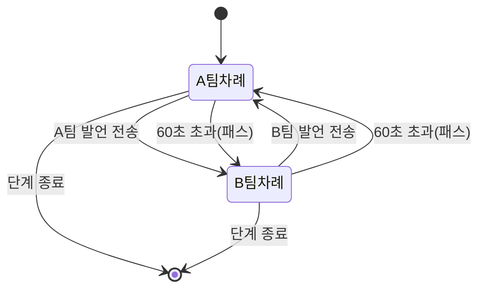
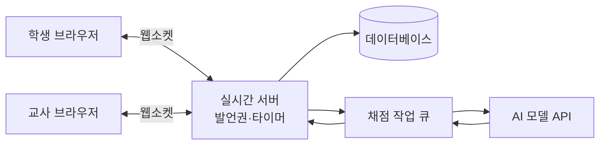

# AI 토론 웹사이트 계획서

작성일: 2026-09-19

## 1. 개요

교사가 만든 주제로 학생들이 팀을 나눠 채팅 토론을 하고, AI가 발언마다 실시간으로 채점해 우승팀과 종합 피드백을 제시하는 수업용 웹사이트입니다.

| 항목 | 내용 |
| --- | --- |
| 서비스명(가칭) | AI 토론 교실 |
| 대상 | 초·중등 교사와 학생 (1개 학급, 토론 1회당 2팀·팀당 3~6명 기준) |
| 사용 환경 | 학교 PC실·태블릿의 웹 브라우저 (앱 설치 없음) |
| 토론 1회 소요 | 약 40분 (수업 1차시) |

**목적**

- 교사가 토론 절차와 시간을 한 화면에서 통제해 수업 운영 부담을 줄입니다.
- 팀 교대 발언 규칙으로 일부 학생의 독점 없이 순서 있는 토론을 만듭니다.
- AI의 실시간 점수와 근거로 학생이 좋은 논증이 무엇인지 즉시 배웁니다.

**기대 효과**

- 말하기가 부담스러운 학생도 글로 참여해 참여율이 높아집니다.
- 모든 발언과 점수 근거가 기록으로 남아 과정 중심 평가 자료로 쓸 수 있습니다.

## 2. 사용자 역할과 전체 흐름

교사는 준비·진행·마무리를 모두 통제하고, 학생은 배정된 방에 들어와 자기 팀 차례에만 발언합니다.

| 역할 | 할 수 있는 일 |
| --- | --- |
| 교사 | 주제·팀 생성, 학생 배정, 단계 시작/정지/연장, 공지, 발언 숨김, AI 점수 수정, 결과 공개 |
| 학생(찬성·반대팀) | 입장 코드로 로그인, 팀 채팅, 자기 팀 차례에 토론방 발언 |
| AI 심판 | 발언 실시간 채점, 점수 근거 표시, 종료 후 우승팀·피드백 생성 |

학생은 교사가 '토론 시작'을 누르기 전까지 대기실에서 주제와 자기 팀만 볼 수 있습니다.

## 3. 토론방 생성·학생 배정·로그인

교사가 주제와 팀을 정하면 시스템이 6자리 입장 코드를 만들고, 학생은 코드와 이름만으로 자기 팀 방에 들어갑니다.

**교사 설정 항목**

| 항목 | 예시 | 비고 |
| --- | --- | --- |
| 토론 주제 | 초등학생에게 스마트폰을 허용해야 한다 | 필수 |
| 팀 이름 | 찬성팀 / 반대팀 | 기본값 제공 |
| 학생 명단 | 이름 붙여넣기 또는 CSV 업로드 | 한 번 등록 후 재사용 |
| 팀 배정 | 드래그 앤 드롭, 무작위 배정 버튼 | 팀 인원 차이 1명 이내 경고 |
| 단계별 시간 | 5장 참고 | 템플릿 저장 가능 |
| 발언 제한 시간 | 60초 | 6장 참고 |
| 채점 기준 | 기본 기준표 또는 교사 수정 | 7장 참고 |

**학생 로그인**

1. 학생이 사이트에 접속해 입장 코드를 입력합니다.
2. 명단에서 자기 이름을 고르고, 교사가 정한 4자리 개인 PIN을 입력합니다.
3. 배정된 팀의 화면으로 바로 들어가며, 다른 팀 채팅에는 접근할 수 없습니다.

같은 이름으로 두 기기에서 접속하면 먼저 들어온 기기를 끊고 교사에게 알림을 보냅니다. 학생 계정·이메일은 받지 않아 개인정보 수집을 최소화합니다.

## 4. 전체 토론방과 팀 채팅 이원화

학생 화면은 왼쪽 '전체 토론방'과 오른쪽 '우리 팀 채팅' 두 칸으로 나뉘며, 채점은 전체 토론방 발언에만 적용됩니다.

| 구분 | 전체 토론방 | 팀 채팅 |
| --- | --- | --- |
| 볼 수 있는 사람 | 전체 학생, 교사 | 같은 팀 학생, 교사 |
| 쓸 수 있는 때 | 우리 팀 발언 차례일 때만 | 토론 중 언제나 |
| 용도 | 공식 주장·반론 | 작전 회의, 근거 찾기, 발언자 정하기 |
| AI 채점 | 대상 | 대상 아님 (교사 참고용 요약만) |
| 교사 개입 | 공지, 발언 숨김 | 열람, 경고 메시지 |

팀 채팅에는 '이 문장을 토론방에 올리기' 버튼을 두어, 팀이 함께 다듬은 문장을 차례가 왔을 때 바로 발언으로 보낼 수 있게 합니다.

## 5. 단계별 진행과 교사 지시

토론은 교사가 정한 시간에 따라 5단계로 진행되며, 단계가 바뀌면 모든 학생 화면에 안내와 남은 시간이 동시에 표시됩니다.

| 단계 | 기본 시간 | 하는 일 | 발언 방식 |
| --- | --- | --- | --- |
| 1. 토론 시작 | 3분 | 교사가 주제·규칙 안내, 팀별 작전 회의 | 토론방 잠김, 팀 채팅만 |
| 2. 주장 | 8분 | 각 팀이 입장과 근거 제시 | 찬성 → 반대 교대 |
| 3. 반론 | 8분 | 상대 주장의 약점 지적 | 반대 → 찬성 교대 |
| 4. 반론꺾기 | 8분 | 받은 반론에 재반박 | 찬성 → 반대 교대 |
| 5. 최종토론 | 6분 | 핵심 정리와 마지막 호소 | 교대, 팀당 최대 2회 |
| 종료 | 5분 | 점수 공개, 우승팀 발표, AI 피드백 | 토론방 잠김 |

**교사 제어 기능**

- 다음 단계로, 일시정지, 시간 1분 연장, 단계 건너뛰기
- 전체 공지: 토론방 맨 위에 고정되어 모든 학생 화면에 강조 표시
- 발언 숨김: 부적절한 발언을 가리고 해당 팀 점수에서 제외

단계 시간이 끝나면 입력 중이던 발언은 자동으로 팀 채팅에 임시 저장되어 사라지지 않습니다.

## 6. 팀 교대 발언권과 시간 초과 처리

전체 토론방에는 한 번에 한 팀만 쓸 수 있고, 한 팀이 한 메시지를 보내거나 60초 안에 쓰지 못하면 발언권이 상대 팀으로 넘어갑니다.

**세부 규칙**

- 차례인 팀에서는 먼저 입력을 시작한 학생이 '발언 중'으로 잠기고, 같은 팀의 다른 학생은 입력창이 막힙니다. 20초간 입력이 없으면 잠금이 풀립니다.
- 발언 한 번은 최대 300자이며, 남은 시간이 입력창 위 막대로 줄어듭니다.
- 10초 남으면 팀 전원에게 알림이 가고, 시간이 지나면 토론방에 '○○팀 패스'가 기록됩니다.
- 연속 2회 패스한 팀은 AI 채점에서 '참여' 항목이 감점되고 교사 화면에 표시됩니다.
- 팀 안에서 발언자가 골고루 나오도록, 이미 2번 말한 학생보다 아직 말하지 않은 학생에게 입력 우선권을 줄지 교사가 켜고 끌 수 있습니다.

발언권 판정과 타이머는 반드시 서버가 관리해, 학생 기기의 시계나 네트워크 지연으로 순서가 어긋나지 않게 합니다.

## 7. AI 실시간 채점과 결과 피드백

AI는 발언이 올라올 때마다 지금까지의 토론 전체 맥락과 현재 단계를 함께 읽고, 기준표에 따라 0~5점과 한 줄 근거를 해당 팀에 줍니다.

**기본 채점 기준표** (교사가 항목·배점 수정 가능)

| 항목 | 보는 것 | 배점(발언당) | 주로 적용 단계 |
| --- | --- | --- | --- |
| 논리성 | 주장과 근거가 이어지는가 | 0~2 | 전체 |
| 근거의 구체성 | 사례·자료·경험 제시 | 0~1 | 주장, 반론꺾기 |
| 상대 발언 반영 | 직전 상대 발언을 정확히 짚었는가 | 0~1 | 반론, 반론꺾기 |
| 단계 적합성 | 지금 단계에 맞는 발언인가 | 0~1 | 전체 |
| 태도(감점) | 인신공격, 비속어, 주제 이탈 | -1~-3 | 전체 |

**실시간 처리 방식**

1. 발언 전송 → 서버가 주제, 현재 단계, 최근 발언 20개, 이전 요약을 묶어 AI에 보냅니다.
2. AI는 항목별 점수, 근거 한 줄, 대응한 상대 발언 번호를 JSON으로 돌려줍니다.
3. 점수는 3~5초 안에 발언 옆 작은 배지로 표시되고, 팀 점수판이 갱신됩니다.
4. 교사는 교사 화면에서 점수를 수정할 수 있고, 수정 이력이 남습니다.

학생 화면에 실시간 점수를 보일지, 종료 후에만 공개할지는 교사가 선택합니다. 점수 경쟁이 과열될 수 있어 저학년은 '종료 후 공개'를 기본값으로 둡니다.

**토론 종료 후 결과**

- 팀별 총점, 단계별 점수, 우승팀 발표 (동점이면 반론꺾기 단계 점수가 높은 팀)
- 토론 전체 피드백: 양 팀의 가장 좋았던 논증, 놓친 반박 지점, 다음 토론을 위한 제안
- 학생별 참여 요약: 발언 수와 잘한 점 한 가지 (교사만 열람)
- 전체 기록을 PDF로 내려받아 평가 자료로 보관

## 8. 화면 구성

교사용 4개, 학생용 3개, 총 7개 화면으로 구성합니다.

| 화면 | 사용자 | 주요 요소 |
| --- | --- | --- |
| 대시보드 | 교사 | 토론 목록, 새 토론 만들기, 지난 결과 보기 |
| 토론 만들기 | 교사 | 주제, 팀·학생 배정, 단계 시간, 채점 기준 설정 |
| 진행 관제실 | 교사 | 단계·타이머 제어, 전체 토론방, 두 팀 채팅 열람, 실시간 점수판, 공지 |
| 결과 보고서 | 교사 | 총점·단계별 점수, AI 피드백, 점수 수정, PDF 내려받기 |
| 입장 | 학생 | 입장 코드, 이름 선택, PIN |
| 토론 화면 | 학생 | 상단: 단계·남은 시간·발언 차례 / 왼쪽: 전체 토론방 / 오른쪽: 팀 채팅 |
| 결과 | 학생 | 우승팀, 팀 점수, 전체 피드백 |

태블릿 세로 화면에서는 전체 토론방과 팀 채팅을 탭으로 전환하고, 우리 팀 차례가 되면 탭에 강조 표시를 띄웁니다.

## 9. 기술 구조와 데이터 모델

실시간 채팅과 서버 타이머가 핵심이므로, 웹소켓 기반 서버 한 곳이 발언권·단계·점수를 모두 결정하는 구조로 만듭니다.

**기술 선택(안)**

| 영역 | 후보 | 이유 |
| --- | --- | --- |
| 화면 | Next.js(React) | 교사·학생 화면을 한 프로젝트로 관리 |
| 실시간 | Socket.IO 또는 Supabase Realtime | 방 단위 채팅, 재접속 처리 |
| 데이터베이스 | PostgreSQL(Supabase) | 토론 기록과 점수 이력 보관 |
| AI 채점 | Claude API | 긴 대화 맥락 이해, JSON 형식 응답 |
| 배포 | Vercel + 실시간 서버 1대 | 학급 단위 사용량에 충분 |

**주요 데이터**

| 테이블 | 핵심 필드 |
| --- | --- |
| debates | 주제, 입장 코드, 현재 단계, 단계별 시간, 상태 |
| teams | 토론 id, 팀 이름, 입장(찬성/반대), 총점 |
| students | 이름, PIN, 팀 id, 접속 상태 |
| messages | 채널(토론방/팀), 작성자, 단계, 내용, 시각, 숨김 여부 |
| scores | 메시지 id, 항목별 점수, AI 근거, 교사 수정값 |
| turns | 단계, 차례 팀, 시작 시각, 결과(발언/패스) |
| reports | 우승팀, 단계별 합계, AI 종합 피드백 |

AI 호출 비용은 발언 1개당 약 1회이며, 40분 토론에서 발언이 약 60~80개 나오는 것으로 예상합니다. 토론 1회당 비용은 사용할 모델 가격을 확인해 개발 초기에 산정합니다.

## 10. 개발 일정, 위험 요소, 향후 확장

약 8주 안에 수업에서 쓸 수 있는 첫 버전을 만들고, 한 학급 시범 수업으로 채점 품질을 검증하는 일정을 제안합니다.

| 기간 | 단계 | 결과물 |
| --- | --- | --- |
| 1~2주 | 설계 | 화면 설계, 채점 기준 확정, 데이터 구조 |
| 3~4주 | 기본 기능 | 토론 생성, 학생 배정·입장, 두 채널 채팅 |
| 5주 | 진행 규칙 | 단계 타이머, 교대 발언권, 시간 초과 패스 |
| 6주 | AI 채점 | 실시간 채점, 점수판, 종료 후 피드백 |
| 7주 | 시범 수업 | 1개 학급 실제 토론, AI 점수와 교사 점수 비교 |
| 8주 | 보완·배포 | 오류 수정, 결과 PDF, 학교 공개 |

**위험 요소와 대응**

| 위험 | 대응 |
| --- | --- |
| AI 점수가 교사 판단과 다름 | 시범 수업에서 비교해 프롬프트 조정, 교사 수정 기능 유지 |
| AI 응답 지연·장애 | 채점은 뒤에서 처리해 채팅은 멈추지 않음, 실패 시 재시도 후 '채점 대기' 표시 |
| 학생 개인정보 | 이름과 PIN만 저장, AI에는 학생 이름 대신 '찬성팀 학생1'로 전달, 보관 기간 설정 |
| 부적절한 발언 | 금칙어 필터, 교사 숨김, AI 태도 감점 |
| 학교 네트워크 차단 | 사전에 학교 방화벽에서 웹소켓 허용 여부 확인 |

**향후 확장**

- 3팀 이상 토론, 모둠별 동시 토론방 여러 개 운영
- 토론 전 AI가 찬반 근거 자료를 추천하는 준비 단계
- 학생별 누적 성장 기록과 학기 말 리포트
